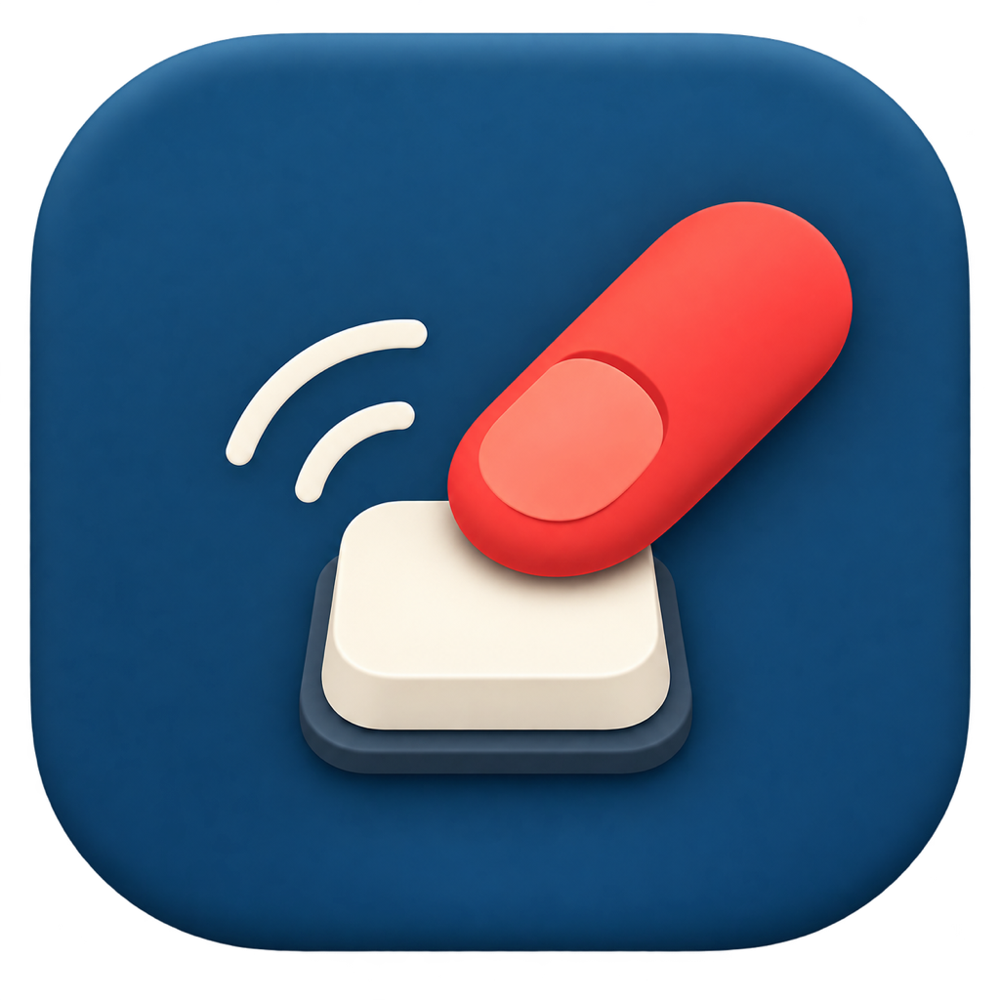

<p align="center">
  
</p>

<h1 align="center">TapKey</h1>

<p align="center">
  Tap your MacBook once, twice, or three times to run any action.
</p>

<p align="center">
  <a href="https://github.com/FirasLatrech/TapKey/releases/latest"><strong>Download TapKey for macOS</strong></a>
</p>

TapKey is a free, open-source macOS menu-bar app for Apple-silicon MacBooks. It reads the built-in motion sensor, never uses the microphone, and makes no network requests.

## Features

- Set a different action for one, two, and three taps.
- Run any keyboard shortcut, including multi-key shortcuts.
- Type custom text.
- Open a URL or an installed application.
- Tune sensitivity, with **Very High** selected by default.

Example: set `2 taps → ⌘⇧D`, `1 tap → Type "Hello"`, and `3 taps → Open Safari`.

## Download

1. Download the latest ZIP from [GitHub Releases](https://github.com/FirasLatrech/TapKey/releases/latest).
2. Unzip it and move **TapKey.app** to **Applications**.
3. Right-click TapKey and choose **Open** the first time. If macOS blocks it, use **System Settings → Privacy & Security → Open Anyway**.
4. Allow Accessibility access. TapKey will restart itself once when access is ready.

Requires macOS 14.6+ on an Apple-silicon MacBook.

## Build from source

Requires Xcode Command Line Tools.

```sh
make run
```

Run the tests with:

```sh
make test
```

The Mac motion-sensor format is not documented by Apple, so a future macOS update may require a fix. Unsupported Macs show a clear error in the menu.

Motion-sensor research: [apple-silicon-accelerometer](https://github.com/olvvier/apple-silicon-accelerometer), [Yamete](https://github.com/Studnicky/yamete), and [nocnoc](https://github.com/shaircast/nocnoc).

## Project

Created and maintained by [Firas Latrach](https://github.com/FirasLatrech). This is a personal project and is not accepting code contributions right now.

## License

[MIT](LICENSE)
